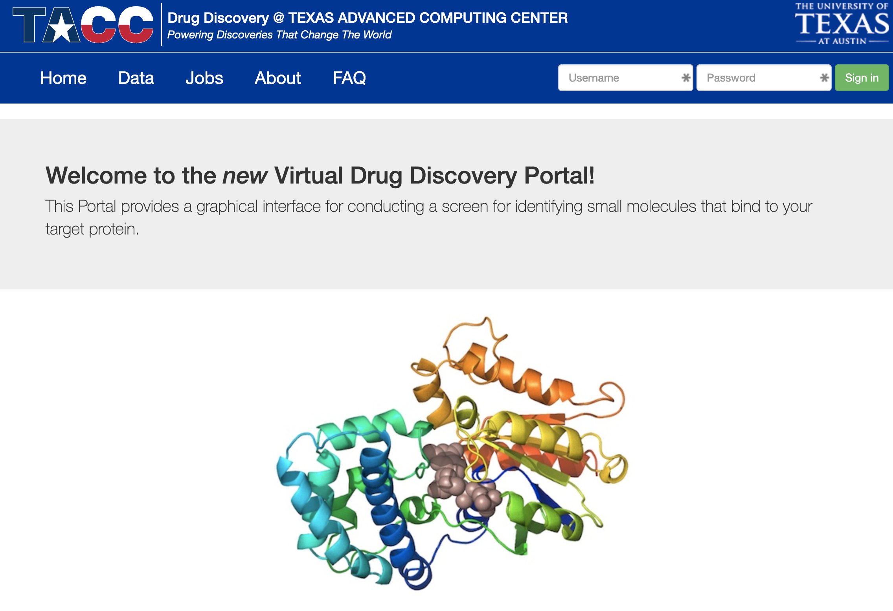
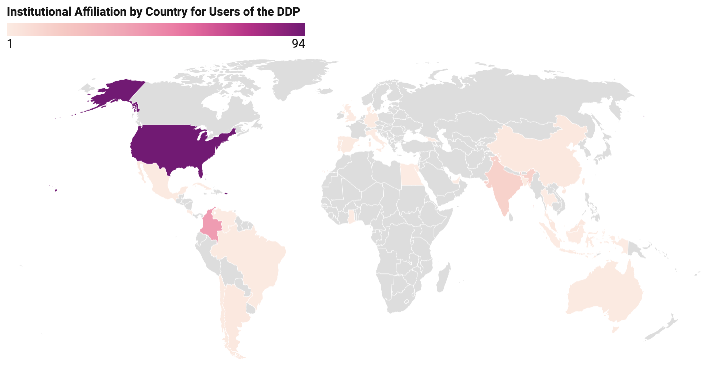
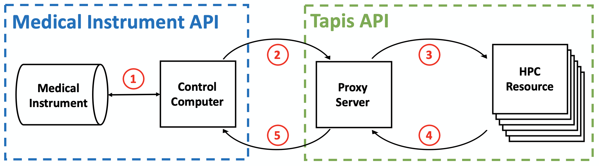
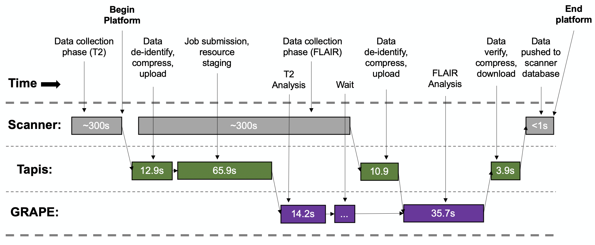
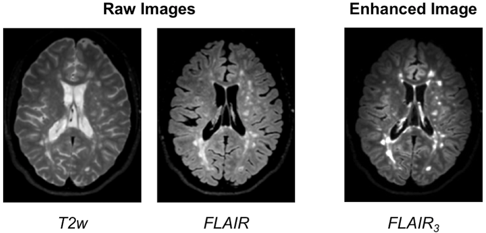

Onboarding to TACC
==================

The Texas Advanced Computing Center (TACC) at UT Austin designs and operates
some of the world's most powerful computing resources. The center's mission is
to enable discoveries that advance science and society through the application
of advanced computing technologies.

We will be using cloud resources at TACC as our development environment. We will
access the cloud resources via our SSH clients and TACC account credentials.

.. attention::

   Everyone please apply for a TACC account now using
   `this link <https://portal.tacc.utexas.edu/web/tup/account-request>`_. If you
   already have a TACC account, you can just use that. Send your TACC username
   to the course instructors via Slack or e-mail as soon as possible (see below).

.. code-block:: console

   To: {wallen, charlie, bkuritz, jstubbs} [at] tacc [dot] utexas [dot] edu
   From: you
   Subject: COE 332 TACC Account
   Body: Please include your name, EID, TACC user name

About TACC
----------

TACC is a Research Center, part of UT Austin, and located at the JJ Pickle
Research Campus.

.. figure:: images/tacc_map.png
    :width: 400px
    :align: center

    A short 7.7 mile walk from main campus!

.. figure:: images/tacc_building.png
    :width: 400px
    :align: center

    One of two TACC buildings located at JJ Pickle.

.. figure:: images/frontera_racks.png
    :width: 400px
    :align: center

    A tall guy standing among taller Frontera racks.

**TACC at a Glance**

.. figure:: images/tacc_at_a_glance_1.png
    :width: 350px
    :align: center

.. figure:: images/tacc_at_a_glance_2.png
    :width: 350px
    :align: center

.. figure:: images/tacc_at_a_glance_3.png
    :width: 350px
    :align: center

**Other TACC Services**

* Portals and gateways
* Web service APIs
* Rich software stacks
* Consulting
* Curation and analysis
* Code optimization
* Training and outreach
* => `Learn more <https://www.tacc.utexas.edu/>`_

.. figure:: images/tacc_portals.png
    :width: 400px
    :align: center

    Snapshot of a few of TACC's portal projects.

**TACC Partnerships**

* NSF: Leadership Class Computing Facility (LCCF)
* NSF: Extreme Science and Engineering Discovery Environment (XSEDE)
* UT Research Cyberinfrastructure (UTRC)
* TX Lonestar Education and Research Network (LEARN)
* Industry, `STAR Program <https://www.tacc.utexas.edu/partnerships/star/partners>`_
* International, The International Collaboratory for Emerging Technologies
* => `Learn more <https://www.tacc.utexas.edu/>`_

.. attention::

   Did you already e-mail your TACC username to the course instructors?

Which brings us to the question of why are we here teaching this class?

Engineering Complex Systems in the Cloud
----------------------------------------

The Tapis Framework, developed at TACC, is a great example of a complex
assembly of code with many moving parts, engineered to help researchers interact
with high performance computing systems in streamlined and automated ways. Tapis
empowers its users to:

* Authenticate using TACC (or other) credentials
* Manage, move, share, and publish data sets
* Run scientific code in batch jobs on clusters
* Set up event-driven processes
* `Many other things! <https://tapis-project.org/>`_

The above description of Tapis and the below schematic diagram are both
intentionally left a little bit vague as we will cover more of the specifics of
Tapis later on in the semester.

.. figure:: images/tapis_framework.png
    :width: 600px
    :align: center

.. tip::

   Astute observers may notice that most, if not all, tools, technologies, and
   concepts that form the Tapis ecosystem show up somewhere in the agenda for
   COE 332.

Demo Applications of Tapis
--------------------------

So what can you do with Tapis?

Why would I want to build something similar?

Why should I learn how to use all of these tools and technologies?

Without concrete examples, it can seem rather esoteric. The two vignettes below
hopefully illustrate how a carefully designed framework can be employed to
tackle real-world problems.

**Vignette 1: Drug Discovery Portal**

*Problem:* The early stages of drug discovery employ a computational process
called "virtual screening" to narrow millions or even billions of potential drug
hits down to a few hundred or thousand that can be tested in a lab. The virtual
screening process can be computationally intensive and difficult for novice
users to do well.

*Importance:* Virtual screening can save a lot of time and money in the drug
discovery process by narrowing the search. Small molecules can be tested for
compatibility with protein targets before the wet lab research begins.

*Approach:* Faculty and staff from UTMB Galveston and TACC used the Tapis
framework to deploy a service for virtual screening in a point-and click web
interface.

*Result:* Users of the "Drug Discovery Portal" can upload target proteins and
click a few buttons to start running large-scale virtual screens directly on
TACC clusters. No prior experience in virtual screening, the Linux command line
interface, or batch queueing systems is required.

    Drug Discovery Portal web interface.

    Researchers from around the world using the platform.

Source: https://doi.org/10.1021/ci500531r

**Vignette 2: Real-Time Quantitative MRI**

*Problem:* Quantitative analysis of MR images is typically performed after the
patient has left the scanner. Corrupted or poor quality images can result in
patient call backs, delaying disease intervention.

*Importance:* Real-time analytics of MRI scans can enable same-session quality
control, reducing patient call backs, and it can enable precision medicine.

*Approach:* Faculty and staff from UTHealth - Houston and TACC used the Tapis
framework to help develop an automated platform for real-time MRI.

*Result:* Scan data can now be automatically processed on high performance
computing resources in real-time with no human intervention.

    Diagram of computer systems and APIs employed.

    Sample platform workflow for combining two images into one enhanced image.

    Final image shows enhanced MS lesions.

Source: https://dx.doi.org/10.1109/JBHI.2017.2771299

.. attention::

   If you already e-mailed your TACC account to the instructors, please go ahead
   and try the exercise below.

Bringing it All Together
------------------------

Hopefully these examples start to show you what kind of software projects we
will be working on this semester. Each week will be introducing a new concept,
tool, or technology that will slowly be building to a larger overall framework
with many moving parts.

For Next Time
-------------

Using your SSH client, please try to log in to the class server **before the
next class period**:

.. code-block:: console
   :emphasize-lines: 1,2,23

   [local]$ ssh username@isp02.tacc.utexas.edu
   username@isp02.tacc.utexas.edu's password:
   Last login: Sun Jan 17 23:48:54 2021 from cpe-24-27-53-74.austin.res.rr.com
   ------------------------------------------------------------------------------
   Welcome to the Texas Advanced Computing Center
      at The University of Texas at Austin

   ** Unauthorized use/access is prohibited. **

   If you log on to this computer system, you acknowledge your awareness
   of and concurrence with the UT Austin Acceptable Use Policy. The
   University will prosecute violators to the full extent of the law.

   TACC Usage Policies:
   http://www.tacc.utexas.edu/user-services/usage-policies/

   TACC Support:
   https://portal.tacc.utexas.edu/tacc-consulting

   ------------------------------------------------------------------------------
   Intel(R) Parallel Studio XE 2017 Update 1 for Linux*
   Copyright (C) 2009-2016 Intel Corporation. All rights reserved.
   [remote]$ hostname -f
   isp02.tacc.utexas.edu      # success!
