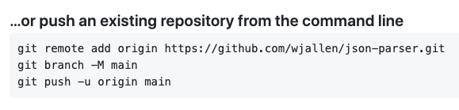

Version Control with Git
========================

In this module, we will look at the version control system **Git**. Of the
numerous version control systems available (Git, Subversion, CVS, Mercurial),
Git seems to be the most popular, and we generally find that it is great for:

* Collaborating with others on code
* Supporting multiple concurrent versions (branches)
* Tagging releases or snapshots in time
* Restoring previous versions of files
* What it lacks in user-friendliness it makes up for in good documentation
* Intuitive web platforms available

After going through this module, students should be able to:

* Create a new Git repository hosted on GitHub
* Clone a repository, commit and push changes to the repository
* Track the history of changes in files in a Git repository
* Work collaboratively with others on the content in a Git repository
* Demonstrate a basic understanding of forking, branching, and tags

GitHub is a web platform where you can host and share Git repositories
("repos"). Repositories can be public or private. Much of what we will do with
this section requires you to have a GitHub account.

The Basics of Git
-----------------

Version control systems start with a base version of the document and then
record changes you make each step of the way. You can think of it as a recording
of your progress: you can rewind to start at the base document and play back
each change you made, eventually arriving at your more recent version.

.. figure:: ./images/play-changes.svg
    :width: 400px
    :align: center

    Changes are saved sequentially.

Once you think of changes as separate from the document itself, you can then
think about "playing back" different sets of changes on the base document,
ultimately resulting in different versions of that document. For example, two
users can make independent sets of changes on the same document.

.. figure:: ./images/versions.svg
    :width: 250px
    :align: center

    Different versions can be saved.

Unless there are conflicts, you can even incorporate two sets of changes into
the same base document.

.. figure:: ./images/merge.svg
    :width: 250px
    :align: center

    Multiple versions can be merged.

A version control system is a tool that keeps track of these changes for us,
effectively creating different versions of our files. It allows us to decide
which changes will be made to the next version (each record of these changes is
called a "commit", and keeps useful metadata about them. The complete history of
commits for a particular project and their metadata make up a "repository".
Repositories can be kept in sync across different computers, facilitating
collaboration among different people.

Setting up Git
--------------

Log on to the class ISP server and check which version of Git is in your
``PATH``.

.. code-block:: bash

   [local]$ ssh username@isp02.tacc.utexas.edu   # use your account
   (enter password)

   [isp02]$ which git
   /opt/apps/git/2.24.1/bin/git
   $ git --version
   git version 1.8.3.1

When we use Git on a new computer for the first time, we need to configure a few
things. Below are a few examples of configurations we will set as we get started
with Git:

* Our name and email address,
* And that we want to use these settings globally (i.e. for every project).

On a command line, Git commands are written as ``git verb``, where ``verb`` is
what we actually want to do. Here is how we set up our environment:

.. code-block:: bash

   [isp02]$ git config --global user.name "Joe Allen"
   [isp02]$ git config --global user.email "wallen@tacc.utexas.edu"

Please use your own name and email address. This user name and email will be
associated with your subsequent Git activity, which means that any changes
pushed to
`GitHub <https://github.com/>`_,
`Bitbucket <https://bitbucket.org/>`_,
`GitLab <https://gitlab.com/>`_ or
another Git host server in the future will include this information.

.. tip::

   A key benefit of Git is that it is platform agnostic. You can use it equally
   to interact with the same files from your laptop, from a lab computer, or
   from a cluster.

Create a New Repository on the Command Line
-------------------------------------------

First, let's navigate back to our folder from the JSON module:

.. code-block:: bash

   [isp02]$ cd ~/coe-332/week02-json

Then we will use a Git command to initialize this directory as a new Git
repository - or a place where Git can start to organize versions of our files.

.. code-block:: bash

   [isp02]$ git init
   Initialized empty Git repository in /home/wallen/coe-332/week02-json/.git/

If we use ``ls -a``, we can see that Git has created a hidden directory called
``.git``:

.. code-block:: bash

   [isp02]$ ls -a
   ./  ../  class.json  .git/  json_ex.py  json_write.py  states.json

Use the ``find`` command to get a overview of the contents of the ``.git/``
directory:

.. code-block:: bash

   [isp02]$ find .git/
   .git
   .git/refs
   .git/refs/heads
   .git/refs/tags
   .git/branches
   .git/description
   .git/hooks
   .git/hooks/applypatch-msg.sample
   .git/hooks/commit-msg.sample
   .git/hooks/post-update.sample
   .git/hooks/pre-applypatch.sample
   .git/hooks/pre-commit.sample
   .git/hooks/pre-push.sample
   .git/hooks/pre-rebase.sample
   .git/hooks/prepare-commit-msg.sample
   .git/hooks/update.sample
   .git/info
   .git/info/exclude
   .git/HEAD
   .git/config
   .git/objects
   .git/objects/pack
   .git/objects/info

Git uses this special sub-directory to store all the information about the
project, including all files and sub-directories located within the project's
directory. If we ever delete the ``.git`` sub-directory, we will lose the
project's history. We can check that everything is set up correctly by asking
Git to tell us the status of our project:

.. code-block:: bash

   [isp02]$ git status
   # On branch master
   #
   # Initial commit
   #
   # Untracked files:
   #   (use "git add <file>..." to include in what will be committed)
   #
   #       class.json
   #       json_ex.py
   #       json_write.py
   #       states.json
   nothing added to commit but untracked files present (use "git add" to track)

.. note::

   If you are using a different version of ``git``, the exact wording of the
   output might be slightly different.

EXERCISE
~~~~~~~~

* Explore the files and folders in the ``.git/`` directory
* Can you find a file with your name and e-mail in it? How did it get there?

Tracking Changes
----------------

We will use this repository track some changes we are about to make to our
example JSON parsing scripts. Above, Git mentioned that it found several
"Untracked files". This means there are files in this current directory that Git
isn't keeping track of. We can instruct Git to start tracking a file using
``git add``:

.. code-block:: bash

   [isp02]$ git add json_ex.py
   [isp02]$ git status
   # On branch master
   #
   # Initial commit
   #
   # Changes to be committed:
   #   (use "git rm --cached <file>..." to unstage)
   #
   #       new file:   json_ex.py
   #
   # Untracked files:
   #   (use "git add <file>..." to include in what will be committed)
   #
   #       class.json
   #       json_write.py
   #       states.json

Commit Changes to the Repo
--------------------------

Git now knows that it's supposed to keep track of ``json_ex.py``, but it hasn't
recorded these changes as a commit yet. To get it to do that, we need to run one
more command:

.. code-block:: bash

   [isp02]$ git commit -m "started tracking json example script"
   [master (root-commit) 344ec9f] started tracking json example script
    1 file changed, 29 insertions(+)
    create mode 100644 json_ex.py

When we run ``git commit``, Git takes everything we have told it to save by
using ``git add`` and stores a copy permanently inside the special ``.git``
directory. This permanent copy is called a "commit" (or "revision") and its
short identifier is ``344ec9f``. Your commit may have another identifier.

We use the ``-m`` flag ("m" for "message") to record a short, descriptive, and
specific comment that will help us remember later on what we did and why. Good
commit messages start with a brief (<50 characters) statement about the changes
made in the commit. Generally, the message should complete the sentence "If
applied, this commit will" `<commit message here>`. If you want to go into more
detail, add a blank line between the summary line and your additional notes. Use
this additional space to explain why you made changes and/or what their impact
will be.

If we run ``git status`` now:

.. code-block:: bash

   $ git status
   # On branch master
   # Untracked files:
   #   (use "git add <file>..." to include in what will be committed)
   #
   #       class.json
   #       json_write.py
   #       states.json
   nothing added to commit but untracked files present (use "git add" to track)

We find three remaining untracked files.

EXERCISE
~~~~~~~~

Do a ``git add <file>`` followed by a ``git commit -m "descriptive message"``
for each file, one by one. Also do a ``git status`` in between each command.

Check the Project History
-------------------------

If we want to know what we've done recently, we can ask Git to show us the
project's history using ``git log``:

.. code-block:: bash

   [isp02]$ git log
   commit 13e07d9dd6a6d3b47f4b7537035c9c532fb7cf4e
   Author: Joe Allen <wallen@tacc.utexas.edu>
   Date:   Wed Jan 27 23:06:29 2021 -0600

       adding states.json

   commit f20159ea98b276ff300b018fa420b514e53e2042
   Author: Joe Allen <wallen@tacc.utexas.edu>
   Date:   Wed Jan 27 23:06:15 2021 -0600

       adding json_write.py

   commit 3d5d6e2c6d23aa4fb3b800b535db6a228759866e
   Author: Joe Allen <wallen@tacc.utexas.edu>
   Date:   Wed Jan 27 23:06:03 2021 -0600

       adding class.json

   commit 344ec9fde550c6e009697b07298919946ff991f9
   Author: Joe Allen <wallen@tacc.utexas.edu>
   Date:   Wed Jan 27 23:00:17 2021 -0600

       started tracking json example script

The command ``git log`` lists all commits  made to a repository in reverse
chronological order. The listing for each commit includes:

* the commit's full identifier (which starts with the same characters as the
  short identifier printed by the ``git commit`` command earlier),
* the commit's author,
* when it was created,
* and the log message Git was given when the commit was created.

Making Further Changes
----------------------

Now suppose we make a change to one of the files we are tracking. Edit the
``json_ex.py`` script your favorite text editor and add some random comments
into the script:

.. code-block:: bash

   [isp02]$ vim json_ex.py
   # make some changes in the script
   # save and quit

When we run ``git status`` now, it tells us that a file it already knows about
has been modified:

.. code-block:: bash

   [isp02]$ git status
   # On branch master
   # Changes not staged for commit:
   #   (use "git add <file>..." to update what will be committed)
   #   (use "git checkout -- <file>..." to discard changes in working directory)
   #
   #       modified:   json_ex.py
   #
   no changes added to commit (use "git add" and/or "git commit -a")

The last line is the key phrase: "no changes added to commit". We have changed
this file, but we haven't told Git we will want to save those changes (which we
do with ``git add``) nor have we saved them (which we do with ``git commit``).
So let's do that now. It is good practice to always review our changes before
saving them. We do this using ``git diff``. This shows us the differences
between the current state of the file and the most recently saved version:

.. code-block:: bash

   [isp02]$ git diff json_ex.py
   diff --git a/json_ex.py b/json_ex.py
   index 5d986e9..21877cb 100644
   --- a/json_ex.py
   +++ b/json_ex.py
   @@ -18,7 +18,7 @@ def check_char_match(str1, str2):
        else:
            return( f'{str1} match FAILS' )

   -
   +# open the json file and load into dict
    with open('states.json', 'r') as f:
        states = json.load(f)

The output is cryptic because it is actually a series of commands for tools like
editors and ``patch`` telling them how to reconstruct one file given the other.
If we break it down into pieces:

* The first line tells us that Git is producing output similar to the Unix
  ``diff`` command comparing the old and new versions of the file.
* The second line tells exactly which versions of the file Git is comparing:
  ``5d986e9`` and ``21877cb`` are unique computer-generated labels for those
  versions.
* The third and fourth lines once again show the name of the file being changed.
* The remaining lines are the most interesting, they show us the actual
  differences and the lines on which they occur. In particular, the ``+`` marker
  in the first column shows where we added lines.

After reviewing our change, it's time to commit it:

.. code-block:: bash

   [isp02]$ git add json_ex.py
   [isp02]$ git commit -m "added a descriptive comment"
   [master 8d5f563] added a descriptive comment
    1 file changed, 1 insertion(+), 1 deletion(-)
   [isp02]$ git status
   # On branch master
   nothing to commit, working directory clean

Git insists that we add files to the set we want to commit before actually
committing anything. This allows us to commit our changes in stages and capture
changes in logical portions rather than only large batches. For example, suppose
we're adding a few citations to relevant research to our thesis. We might want
to commit those additions, and the corresponding bibliography entries, but *not*
commit some of our work drafting the conclusion (which we haven't finished yet).

Directories in Git
------------------

There are a couple important facts you should know about directories in Git.
First, Git does not track directories on their own, only files within them. Try
it for yourself:

.. code-block:: bash

   [isp02]$ mkdir directory
   [isp02]$ git status
   [isp02]$ git add directory
   [isp02]$ git status

Note, our newly created empty directory ``directory`` does not appear in the
list of untracked files even if we explicitly add it (*via* ``git add``) to our
repository.

Second, if you create a directory in your Git repository and populate it with files,
you can add all files in the directory at once by:

.. code-block:: bash

   [isp02]$ git add <directory-with-files>

.. tip::

   A trick for tracking an empty directory with Git is to add a hidden file to
   the directory. People sometimes will label this ``.gitcanary``. Adding and
   committing that file to the repo's history will cause the directory it is in
   to also be tracked.

Restoring Old Versions of Files
-------------------------------

We can save changes to files and see what we've changed — now how can we restore
older versions of things? Let's suppose we accidentally overwrite our file:

.. code-block:: bash

   [isp02]$ echo "" > json_ex.py
   [isp02]$ cat json_ex.py

Now ``git status`` tells us that the file has been changed, but those changes
haven't been staged:

.. code-block:: bash

   [isp02]$ git status
   # On branch master
   # Changes not staged for commit:
   #   (use "git add <file>..." to update what will be committed)
   #   (use "git checkout -- <file>..." to discard changes in working directory)
   #
   #       modified:   json_ex.py
   #
   no changes added to commit (use "git add" and/or "git commit -a")

We can put things back the way they were by using ``git checkout`` and referring
to the *most recent commit* of the working directory by using the identifier
``HEAD``:

.. code-block:: bash

   [isp02]$ git checkout HEAD json_ex.py
   [isp02]$ cat json_ex.py
   import json
   ...etc

As you might guess from its name, ``git checkout`` checks out (i.e., restores)
an old version of a file. In this case, we're telling Git that we want to
recover the version of the file recorded in ``HEAD``, which is the last saved
commit. If we want to go back even further, we can use a commit identifier
instead:

.. code-block:: bash
   :emphasize-lines: 26

   [isp02]$ git log
   commit 8d5f563fa20060f4fbe2e10ec5cbc3c22fe92559
   Author: Joe Allen <wallen@tacc.utexas.edu>
   Date:   Wed Jan 27 23:15:46 2021 -0600

    added a descriptive comment

   commit 13e07d9dd6a6d3b47f4b7537035c9c532fb7cf4e
   Author: Joe Allen <wallen@tacc.utexas.edu>
   Date:   Wed Jan 27 23:06:29 2021 -0600

    adding states.json

   commit f20159ea98b276ff300b018fa420b514e53e2042
   Author: Joe Allen <wallen@tacc.utexas.edu>
   Date:   Wed Jan 27 23:06:15 2021 -0600

    adding json_write.py

   commit 3d5d6e2c6d23aa4fb3b800b535db6a228759866e
   Author: Joe Allen <wallen@tacc.utexas.edu>
   Date:   Wed Jan 27 23:06:03 2021 -0600

    adding class.json

   commit 344ec9fde550c6e009697b07298919946ff991f9
   Author: Joe Allen <wallen@tacc.utexas.edu>
   Date:   Wed Jan 27 23:00:17 2021 -0600

    started tracking json example script

.. code-block:: bash

   [isp02]$ git checkout 344ec9f json_ex.py
   # now you have a copy of json_ex.py without that comment we added

Again, we can put things back the way they were by using ``git checkout``:

.. code-block:: bash

   [isp02]$ git checkout HEAD json_ex.py
   # back to the most recent version

Link a Local Repository to GitHub
---------------------------------

Version control really comes into its own when we begin to collaborate with
other people.  We already have most of the machinery we need to do this; the
only thing missing is to copy changes from one repository to another.

Systems like Git allow us to move work between any two repositories.  In
practice, though, it's easiest to use one copy as a central hub, and to keep it
on the web rather than on someone's laptop.  Most programmers use hosting
services like GitHub, Bitbucket, or GitLab <https://gitlab.com/> to hold those
main copies.

Let's start by sharing the changes we've made to our current project with the
world. Log in to GitHub, then click on the icon in the top right corner to
create a new repository:

.. figure:: ./images/github_new_repo.png
   :width: 400px
   :align: center

   Click 'New repository'.

As soon as the repository is created, GitHub displays a page with a URL and some
information on how to configure your local repository. Provide a name for your
new repository like ``json-parser`` (or whatever you want).

Note that our local repository still contains our earlier work on ``json_ex.py``
and other files, but the remote repository on GitHub doesn't contain any memory
of ``json_ex.py`` yet. The next step is to connect the two repositories.  We do
this by making the GitHub repository a "remote" for the local repository. The
home page of the repository on GitHub includes the string we need to identify it:

   Follow the instructions for pushing an existing repository.

Back on ISP in the local Git repo, link it to the repo on GitHub and confirm the
link was created:

.. code-block:: bash

   [isp02]$ git remote add origin https://github.com/wjallen/json-parser.git
   [isp02]$ git remote -v
   origin  https://github.com/wjallen/json-parser.git (fetch)
   origin  https://github.com/wjallen/json-parser.git (push)

.. attention::

   Make sure to use the URL for your repository instead of the one listed here.

The name ``origin`` is a local nickname for your remote repository. We could use
something else if we wanted to, but ``origin`` is by far the most common choice.

Once the nickname ``origin`` is set up, this command will push the changes from
our local repository to the repository on GitHub:

.. code-block:: bash

   [isp02]$ git branch -M main
   [isp02]$ git push -u origin main
   Username for 'https://github.com': wjallen
   Password for 'https://wjallen@github.com':
   Counting objects: 15, done.
   Delta compression using up to 4 threads.
   Compressing objects: 100% (14/14), done.
   Writing objects: 100% (15/15), 2.30 KiB | 0 bytes/s, done.
   Total 15 (delta 4), reused 0 (delta 0)
   remote: Resolving deltas: 100% (4/4), done.
   To https://github.com/wjallen/json-parser.git
    * [new branch]      main -> main
   Branch main set up to track remote branch main from origin.

Clone the Repository
--------------------

Spend a few minutes browsing the web interface for GitHub. Now, anyone can make
a full copy of ``my_first_repo`` including all the commit history by performing:

.. code-block:: bash

   [isp02]$ git clone https://github.com/wjallen/json-parser
   Cloning into 'json-parser'...
   remote: Enumerating objects: 15, done.
   remote: Counting objects: 100% (15/15), done.
   remote: Compressing objects: 100% (10/10), done.
   remote: Total 15 (delta 4), reused 15 (delta 4), pack-reused 0
   Unpacking objects: 100% (15/15), done.

Collaborating with Others
-------------------------

A public platform like GitHub makes it easier than ever to collaborate with
others on the content of a repository. You can have as many local copies of a
repository as you want, but there is only one "origin" repository - the
repository hosted on GitHub. Other repositories may fall behind the origin, or
have changes that are ahead of the origin. A common model for juggling multiple
repositories where separate individuals are working on different features is the
`GitFlow model <https://datasift.github.io/gitflow/IntroducingGitFlow.html>`_:

.. figure:: ./images/GitFlowMasterBranch.png
   :width: 500px
   :align: center

   GitFlow model

Some important definitions (most can easily be managed right in the GitHub web
interface):

FORK
~~~~

A fork is a personal copy of another user's repository that lives on your
account. Forks allow you to freely make changes to a project without affecting
the original. Forks remain attached to the original, allowing you to submit a
pull request to the original's author to update with your changes. You can also
keep your fork up to date by pulling in updates from the original.

BRANCH
~~~~~~

A branch is a parallel version of a repository. It is contained within the
repository, but does not affect the primary or master branch allowing you to
work freely without disrupting the "live" version. When you've made the changes
you want to make, you can merge your branch back into the master branch to
publish your changes. For more information, see
`About branches <https://help.github.com/articles/about-branches>`_.

TAG
~~~

Git has the ability to tag specific points in history as being important.
Typically people use this functionality to mark release points (v1.0, and so
on).

PULL REQUEST / MERGE REQUEST
~~~~~~~~~~~~~~~~~~~~~~~~~~~~

Pull requests are proposed changes to a repository submitted by a user and
accepted or rejected by a repository's collaborators. Like issues, pull requests
ach have their own discussion forum. For more information, see `About pull
requests <https://help.github.com/articles/about-pull-requests>`_.

OTHER CONSIDERATIONS
~~~~~~~~~~~~~~~~~~~~

Most repos will also contain a few standard files in the top directory,
including:

**README.md**: The landing page of your repository on GitHub will display the
contents of README.md, if it exists. This is a good place to describe your
project and list the appropriate citations.

**LICENSE.txt**: See if your repository needs a license
`here <https://help.github.com/articles/licensing-a-repository/>`_.

Additional Resources
--------------------

* Some of the materials in this module were based on `Software Carpentry <https://github.com/swcarpentry/git-novice>`_ DOI: 10.5281/zenodo.57467.
* `GitHub Glossary <https://help.github.com/articles/github-glossary/>`_
* `About Branches <https://help.github.com/articles/about-branches>`_
* `About Pull Requests <https://help.github.com/articles/about-pull-requests>`_
* `About Licenses <https://help.github.com/articles/licensing-a-repository/>`_
* `GitFlow Model <https://datasift.github.io/gitflow/IntroducingGitFlow.html>`_
* `More on different git workflows <https://www.atlassian.com/git/tutorials/comparing-workflows>`_
