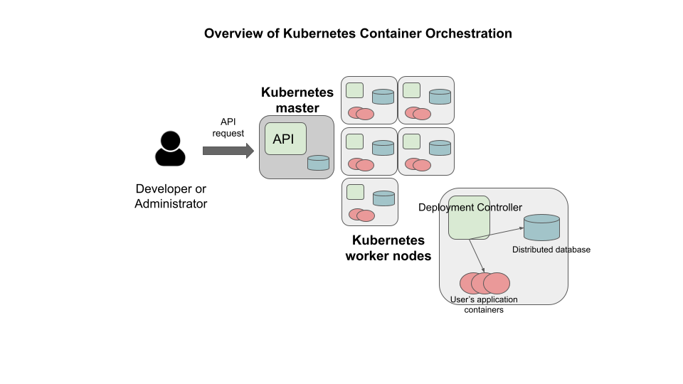

Kubernetes - Overview and Introduction to Pods
==============================================

In this section we give an overview of the Kubernetes system and introduce the first major Kubernetes abstraction, the Pod.

Kubernetes Overview
~~~~~~~~~~~~~~~~~~~
Kubernetes (k8s) is itself a distributed system of software components that run a cluster of one or more machines (physical
computers or virtual machines). Each machine in a k8s cluster is either a "master" or a "worker" node.

Users communicate with k8s by making requests to its API. The following steps outline how Kubernetes works at a high level:

 1) Requests to k8s API describe the user's *desired state* on the cluster; for example, the desire that 3 containers of
    a certain image are running.
 2) The k8s API schedules new containers to run on one or more worker nodes.
 3) After the container is started, the Kubernetes deployment controller, installed on each worker node, monitors the
    containers on the node.
 4) The k8s components, including the API and the deployment controllers, maintain both the *desired state* and the
    *actual state* in a distributed database. The components continuously coordinate together to make the actual state
    converge to the desired state.

Connecting to the TACC Kubernetes Instance
------------------------------------------
In this class, we will use TACC's FreeTail Kubernetes cluster for deploying our applications. To connect to it, use SSH
and your TACC username as follows:

.. code-block::

 $ ssh <tacc_username>@freetail.tacc.utexas.edu

You will be prompted for your TACC username and password, just as you are when connecting to isp02.

First Commands with k8s
-----------------------

We will use the Kubernetes Command Line Interface (CLI) referred to as "kubectl" (pronounced "Kube control") to make
requests to the Kubernetes API. We could use any HTTP client, including a command-line client such as curl, but ``kubectl``
simplifies the process of formatting requests.

The ``kubectl`` software should already be installed and configured to use the Freetail K8s cluster. Let's verify that
is the case by running the following:

.. code-block:: bash

  $ kubectl version -o yaml

You should see output similar to the following:

.. code-block:: bash

    clientVersion:
      buildDate: "2021-01-13T13:28:09Z"
      compiler: gc
      gitCommit: faecb196815e248d3ecfb03c680a4507229c2a56
      gitTreeState: clean
      gitVersion: v1.20.2
      goVersion: go1.15.5
      major: "1"
      minor: "20"
      platform: linux/amd64
    serverVersion:
      buildDate: "2020-11-11T13:09:17Z"
      compiler: gc
      gitCommit: d360454c9bcd1634cf4cc52d1867af5491dc9c5f
      gitTreeState: clean
      gitVersion: v1.19.4
      goVersion: go1.15.2
      major: "1"
      minor: "19"
      platform: linux/amd64

This command made an API request to the TACC Freetail k8s cluster and returned information about the version
of k8s running there (under ``serverVersion``) as well as the version of the `kubectl`` that we are running (under
``clientVersion``).

.. note::

  The output of the ``kubectl`` command was yaml because we used the ``-o yaml`` flag. We could have asked for the output
  to be formatted in json with ``-o json``. The ``-o`` flag is widely available on ``kubectl`` commands.

Introduction to Pods
~~~~~~~~~~~~~~~~~~~~

Pods are a fundamental abstraction within Kubernetes and are the most basic unit of computing that can be deployed onto
the cluster. A pod can be thought of as generalizing the notion of a container: a pod contains one or more containers
that are tightly coupled and need to be scheduled together, on the same computer, with access to a shared file system
and a shared network address.

.. note::

  By far, the majority pods you will meet in the wild, including the ones used in this course, will only include one
  container. A pod with multiple containers can be thought of as an "advanced" use case.

Hello, Kubernetes
~~~~~~~~~~~~~~~~~

To begin, we will define a pod with one container. As we will do with all the resources we want to create in k8s, we
will describe our pod in a yaml file.

Create a file called ``pod-basic.yml``, open it up in an editor and paste the following code in:

.. code-block:: yaml

    ---
    apiVersion: v1
    kind: Pod
    metadata:
      name: hello
    spec:
      containers:
        - name: hello
          image: ubuntu:18.04
          command: ['sh', '-c', 'echo "Hello, Kubernetes!" && sleep 3600']

Let's break this down. The top four stanzas are common to all k8s resource descriptions:

  * ``apiVersion`` -- describes what version of the k8s API we are working in. We are using ``v1``.
  * ``kind`` -- tells k8s what kind of resource we are describing, in this case a ``Pod``.
  * ``metadata`` -- in general, this is additional information about the resource we are describing that doesn't pertain
    to its operation. Here, we are giving our pod a ``name``, ``hello``.
  * ``spec`` -- This is where the actual description of the resource begins. The contents of this stanza vary depending
    on the ``kind`` of resource you are creating. We go into more details on this in the next section.

The Pod Spec
~~~~~~~~~~~~

In k8s, you describe resources you want to create or update using a ``spec``. The required and optional parameters
available depend on the ``kind`` of resource you are describing.

The pod spec we defined looked like this:

.. code-block:: yaml

    spec:
      containers:
        - name: hello
          image: ubuntu:18.04
          command: ['sh', '-c', 'echo "Hello, Kubernetes!" && sleep 3600']

There is just one stanza, the ``containers`` stanza, which is a list of containers (recall that pods can contain
multiple containers). Here we are defining just one container. We provide:

  * ``name`` (optional) -- this is the name of the container, similar to the name attribute in Docker.
  * ``image`` -- the image we want to use for the container, just like with Docker.
  * ``command`` (optional) -- the command we want to run in the container. Here we are running a short BASH script.

Creating the Pod In K8s
~~~~~~~~~~~~~~~~~~~~~~~

We are now ready to create our pod in k8s. To do so, we use the ``kubectl apply`` command. In general, when you have
a description of a resource that you want to create or update in k8s, the ``kubectl apply`` commnanf can be used.

In this case, our description is contained in a file, so we use the ``-f`` flag. Try this now:

.. code-block:: bash

  $ kubectl apply -f pod-basic.yml

If all went well and k8s accepted your request, you should see an output like this:

.. code-block:: bash

  pod/hello created

In practice, we won't be creating many ``Pod`` resources directly -- we'll be creating other resources, such as
``deployments`` that are made up of pods -- but it is important to understand pods and to be able to work
with pods using ``kubectl`` for debugging and other management tasks.

Working With Pods
~~~~~~~~~~~~~~~~~

We can use additional ``kubectl`` commands to get information about the pods we run on k8s.

Listing Pods
-------------
For example, we can list the pods on the cluster with ``kubectl get <object_type>`` -- in this case, the object type
is "pods":

.. code-block:: bash

  $ kubectl get pods

    NAME                             READY   STATUS    RESTARTS   AGE
    ds-staging-6df657fbd-tbht5       1/1     Running   0          34d
    elasticsearch-748f666f4f-svf2h   1/1     Running   0          76d
    hello                            1/1     Running   0          3s
    kibana-f5b79569f-r4pl6           1/1     Running   0          78d
    sidecartest-5454b7d49b-q8fvw     3/3     Running   472        78d

The output is fairly self-explanatory. We see a line for every pod which includes its name, status, the number of times
it has been restarted and its age. Our ``hello`` pod is listed above, with an age of ``3s`` because we just started it
but it is already RUNNING. Several additional pods are listed in my output above due to prior work sessions.

A Word on Authentication and Namespaces
---------------------------------------

With all the students running their own pods on the same k8s cluster, you might be wondering why you only see your
pod or why you don't see my pods? The reason is that when you make an API request to k8s, you tell the API who you
are and what *namespace* you want to make the request in. Namespaces in k8s are logically isolated views or partitions
of the k8s objects. Your ``kubectl`` client is configured to make requests in a namespace that is private to you; we set
these namespaces up for COE 332.

Geting and Describing Pods
--------------------------

We can pass the pod name to the ``get`` command -- i.e.,``kubectl get pods <pod_name>`` -- to just get information on
a single pod

.. code-block:: bash

  $ kubectl get pods hello
    NAME    READY   STATUS    RESTARTS   AGE
    hello   1/1     Running   0          3m1s

The ``-o wide`` flag can be used to get more information:

.. code-block:: bash

  $ kubectl get pods hello -o wide
    NAME    READY   STATUS    RESTARTS   AGE    IP            NODE   NOMINATED NODE   READINESS GATES
    hello   1/1     Running   0          3m1s   10.244.5.28   c04    <none>           <none>

Finally, the ``kubectl decribe <resource_type> <resource_name>`` command gives additional information, including the
k8s events at the bottom. While we won't go into the details now, this information can be helpful when troublshooting
a pod that has failed:

.. code-block:: bash

  $ kubectl describe pods hello
    Name:         hello
    Namespace:    designsafe-jupyter-stage
    Priority:     0
    Node:         c04/172.16.120.11
    Start Time:   Fri, 26 Feb 2021 10:12:43 -0600
    Labels:       <none>
    Annotations:  <none>
    Status:       Running
    IP:           10.244.5.28
    IPs:
      IP:  10.244.5.28
    Containers:
      hello:
        Container ID:  containerd://b0e2d0eb8dc7717567886c99cfb30b9245c99f2b2f3a6610d5d6fe24fe8866b8
        Image:         ubuntu:18.04
        Image ID:      docker.io/library/ubuntu:18.04@sha256:c6b45a95f932202dbb27c31333c4789f45184a744060f6e569cc9d2bf1b9ad6f
        Port:          <none>
        Host Port:     <none>
        Command:
          sh
          -c
          echo "Hello, Kubernetes!" && sleep 3600
        State:          Running
          Started:      Mon, 01 Mar 2021 11:14:38 -0600
        Last State:     Terminated
          Reason:       Completed
          Exit Code:    0
          Started:      Mon, 01 Mar 2021 10:14:37 -0600
          Finished:     Mon, 01 Mar 2021 11:14:37 -0600
        Ready:          True
        Restart Count:  73
        Environment:    <none>
        Mounts:
          /var/run/secrets/kubernetes.io/serviceaccount from default-token-xpg9m (ro)
    Conditions:
      Type              Status
      Initialized       True
      Ready             True
      ContainersReady   True
      PodScheduled      True
    Volumes:
      default-token-xpg9m:
        Type:        Secret (a volume populated by a Secret)
        SecretName:  default-token-xpg9m
        Optional:    false
    QoS Class:       BestEffort
    Node-Selectors:  <none>
    Tolerations:     node.kubernetes.io/not-ready:NoExecute op=Exists for 300s
                     node.kubernetes.io/unreachable:NoExecute op=Exists for 300s
    Events:
      Type    Reason   Age                    From     Message
      ----    ------   ----                   ----     -------
      Normal  Pulling  9m32s (x74 over 3d1h)  kubelet  Pulling image "ubuntu:18.04"
      Normal  Created  9m31s (x74 over 3d1h)  kubelet  Created container hello
      Normal  Started  9m31s (x74 over 3d1h)  kubelet  Started container hello
      Normal  Pulled   9m31s                  kubelet  Successfully pulled image "ubuntu:18.04" in 601.12516ms

Getting Pod Logs
----------------

Finally, we can use ``kubectl logs <pod_name>`` command to get the logs associated with a pod:

.. code-block:: bash

  $ kubectl logs hello
    Hello, Kubernetes!

Note that the ``logs`` command does not include the resource name ("pods") because it only can be applied to pods. The
``logs`` command in k8s is equivalent to that in Docker; it returns the standard output (stdout) of the container.

Additional Resources
====================

 * `k8s Pod Reference <https://kubernetes.io/docs/concepts/workloads/pods/>`_

