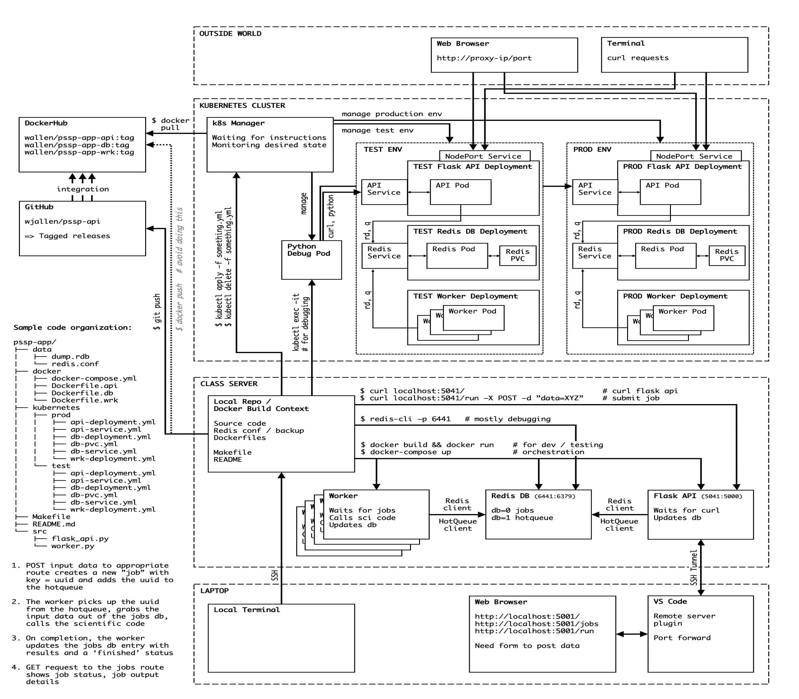

Conceptualization
=================

This demo final project for COE 332 is called **PSSP API**. It is a REST API
interface to a scientific code base. The scientific code used here is a protein
secondary structure prediction (PSSP) tool called
`Predict_Property <https://github.com/realbigws/Predict_Property>`_.

Background
----------

Protein secondary structure, or the local folded structures that form within a
protein, can be predicted somewhat successfully from the primary amino acid
sequence. Researchers have developed tools that take amino acid sequence as input
(e.g. 'AAAAAAA'), and return the likelihood of different folded structures
occurring at each position.

Many of these tools are Linux command line tools. It would be useful and
interesting to have an intuitive REST API for calling one of these tools, so that
users can perform these prediction calculations without necessarily having command
line experience or without installing the tool themselves. Further, this is a
first step toward encapsulating the function of the scientific code base into a
web interface.

Scope
-----

The scope of this project is narrow. It should be designed to expect only one kind
of input: protein primary sequences as a string of letters. It performs the same
standard analysis using the *Predict_Property* command line tools each time. The
expected results returned always follow the same 8-line format shown below
(# annotations on each line not included with the result):

.. code-block:: text

    > Header Info     #-> header / metadata including job id
    ASDFASDGFAGASG    #-> user input sequence with invalid amino acid shown as 'X'.
    HHHHEEECCCCCHH    #-> 3-class secondary structure (SS3) prediction.
    HHGGEEELLSSTHH    #-> 8-class secondary structure (SS8) prediction.
    EEMMEEBBEEEBBM    #-> 3-state solvent accessibility (ACC) prediction.
    *****......***    #-> disorder (DISO) prediction, with disorder residue shown as '*'.
    _____HHHHH____    #-> 2-class transmembrane topology (TM2) prediction.
    UU___HHHHH____    #-> 8-class transmembrane topology (TM8) prediction.

Here are a few tables for interpreting the results:

=====  ========  =====  =========
 SS3              SS8
---------------  ----------------
 Key    Value     Key    Value
=====  ========  =====  =========
 H      a-helix   H      a-helix
 E      b-sheet   G      3-helix
 C      coil      I      5-helix
 .      .         E      b-strand
 .      .         B      b-bridge
 .      .         T      turn
 .      .         S      bend
 .      .         L      loop
=====  ========  =====  =========

=====  =========  =====  ===================
 ACC               DISO
----------------  --------------------------
 Key    Value      Key    Value
=====  =========  =====  ===================
 B      buried     \*     disordered
 M      medium     _      not disordered
 E      exposed    .      .
=====  =========  =====  ===================

=====  ==================  =====  ===================
 TM2                        TM8
-------------------------  --------------------------
 Key    Value               Key    Value
=====  ==================  =====  ===================
 H      transmembrane       H      transmem helix
 _      not transmembrane   E      transmem strand
 .      .                   C      transmem coil
 .      .                   I      membrane-inside
 .      .                   L      membrane-loop
 .      .                   F      interfacial helix
 .      .                   X      unknown localizations
 .      .                   _      not transmembrane
=====  ==================  =====  ===================

User Interface
--------------

With this API, users should have access to a number of curl routes to GET
information about the service, and about past jobs that have been run. E.g.:

.. code-block:: text

    curl localhost:5041/             # general info
    curl localhost:5041/run          # get instructions to submit a job
    curl localhost:5041/jobs         # get past jobs
    curl localhost:5041/jobs/JOBID   # get results for JOBID

Users should also be able to POST protein primary sequences (e.g 'AAAAAAA') to a
defined route, and in return they will receive a Job ID.

.. code-block:: text

    curl -X POST -d "seq=AAAAA" localhost:5041/run

Technologies / Architecture
---------------------------

There will be two "environments" used to develop, test, and deploy this API. They
will be referred to as:

* **The Development Environment** refers to the class ISP server. This env will
  be used to develop new features / routes in the source code. Containers
  will be built and deployed using docker and docker-compose commands. Services
  will be tested by directly connecting to the containers.

* **The Deployment Environment** refers to the Kubernetes cluster. This env will
  host both a testing (also called "staging") and production deployment of the
  full API. No code edits will take place in this environment. It will exclusively
  pull pre-built / tagged containers from Docker Hub for the runtime.

.. note::

   Our deployment environment is a local Kubernetes Cluster, but it could just as
   easily have been AWS, Azure, Google Cloud, etc.

    Design diagram

The different components of this environment will be described in the following
pages.
