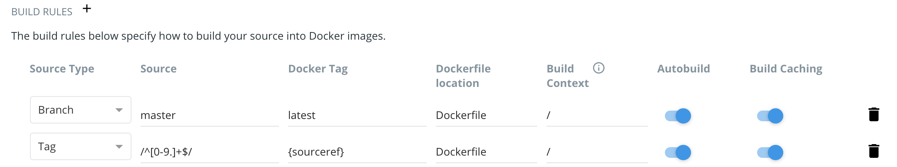

Continuous Integration
======================

The primary goal of Continuous Integration (CI) is to enable multiple developers
to work on the same code base while ensuring the quality of the final product.

This involves the following challenges:

* No one person has complete knowledge of the entire system.
* Multiple changes can be happening at the same time. Even if the changes are
  made in different components, it is possible for something to break when they
  are integrated.

Enabling Large Teams to Work on a System Simultaneously
-------------------------------------------------------

An "integration server" (or "build server") is a dedicated server (or VM) that
prepares software for release. The server automates common tasks, including:

* Building software binaries from source code (for compiled languages)
* Running tests
* Creating images, installers, or other artifacts
* Deploying/installing the software

We are ultimately aiming for the following "Continuous Integration" work flow or
process; this mirrors the process used by a number of teams working on "large"
software systems, both in academia and industry:

* Developers (i.e., you) check out code onto a machine where they will do their
  work. This could be a VM somewhere or their local laptop.
* They make changes to the code to add a feature or fix a bug.
* Once their work is done they add any additional tests as needed and then run
  all unit tests "locally" (i.e., on the same machine).
* Assuming the tests pass, the develop commits their changes and pushes to the
  remote origin (in this case, GitHub).
* A pre-established build server gets a message from the origin that a new commit was pushed.
* The build server:

  * Checks out the latest version
  * Executes any build steps to create the software
  * Runs unit tests
  * Starts an instance of the system
  * Runs integration tests
  * Deploys the software to a staging environment

If any one of the steps above fails, the process stops. In such a situation, the
code defect should be addressed as soon as possible.

Popular Automated CI Services
------------------------------

**Jenkins** is one of the most popular free open-source CI services. It is
server-based, and it requires a web server to operate on.

* Local application
* Completely free
* Deep workflow customization
* Intuitive web interface management
* Can be distributed across multiple machines / VMs
* Rich in features and plugins
* Easy installation thanks to the pre-installed OS X, Unix and Windows packages
* A well-established product with an excellent reputation

**TravisCI** is another CI service with limited features in the free tier, and a
comprehensive paid tier. It is a cloud-hosted service, so there is no need for
you to host your own server.

* Quick setup
* Live build views
* Pull request support
* Multiple languages and platforms support
* Pre-installed database services
* Auto deployments on passing builds
* Parallel testing (paid tier)
* Scaling capacity on demand (paid tier)
* Clean VMs for every build
* Mac, Linux, and iOS support
* Connect with Github, Bitbucket and more

**GitHub Actions** is a relatively new CI service used to automate, customize,
and execute software development workflows right in your GitHbu repository.

* One interface for both your source code repositories and your CI/CD pipelines
* Catalog of available Actions you can utilize without reinventing the wheel
* Includes macOS builds as part of free tier (macOS builds require 10 credits
  per build minute however compared to 1 credit per minute for linux)
* Free tier credits are renew/reset each month
* It is a new platform, so not as many features as some of the others

GitHub-Docker Hub Integration
-----------------------------

A quick-and-easy way to implement some parts of CI for our app is to use a handy
GitHub-Docker Hub Integration.

Rather than commit to GitHub AND push to Docker Hub each time you want to
release a new version of code, you can set up an integration between the two
services that automates it. The key benefit is you only have to commit to one
place (GitHub), and you know the image available on Docker Hub is always in sync.

To set up the integration, navigate to an existing Docker repository that you own
in a web browser, which should be at an address similar to:

https://hub.docker.com/repository/docker/YOUR-DOCKER-USERNAME/pssp-app-api

.. tip::

   You can click ``+ New Repository`` if it doesn't exist yet.

Click on Builds => Link to GitHub. (If this is your first time connecting a
Docker repo to a GitHub repo, you will need to set it up. Press the ‘Connect’
link to the right of ‘GitHub’. If you are already signed in to both Docker
and GitHub in the same browser, it takes about 15 seconds to set up).

Once you reach the Build Configurations screen, you will select your GitHub
username and repository named, e.g., ``pssp-api``.

Leaving all the defaults selected will cause this Docker image to rebuild
every time you push code to the master branch of your GitHub repo. For this
example, set the build to to trigger whenever a new release is tagged:

Click ‘Save and Build’ and check the 'Timeline' tab on Docker Hub to see if it
is working as expected.

EXERCISE
~~~~~~~~

In your own GitHub account, fork this repository:

https://github.com/wjallen/pssp-api

Create the same GitHub - Docker Hub integration shown above, write a new feature
as described below, and tag a new release to trigger a build.

Commit to GitHub
----------------

To trigger the build in a real-world scenario, make some changes to your source
code, push your modified code to GitHub and tag the release as ``X.Y.Z`` (whatever
new tag is appropriate) to trigger another automated build:

.. code-block:: bash

   $ git add *
   $ git commit -m "added a new route to delete jobs"
   $ git push
   $ git tag -a 0.1.4 -m "release version 0.1.4"
   $ git push origin 0.1.4

By default, the git push command does not transfer tags, so we are explicitly
telling git to push the tag we created (0.1.4) to the remote (origin).

Now, check the online GitHub repo to make sure your change / tag is there, and
check the Docker Hub repo to see if your image is automatically rebuilding.
